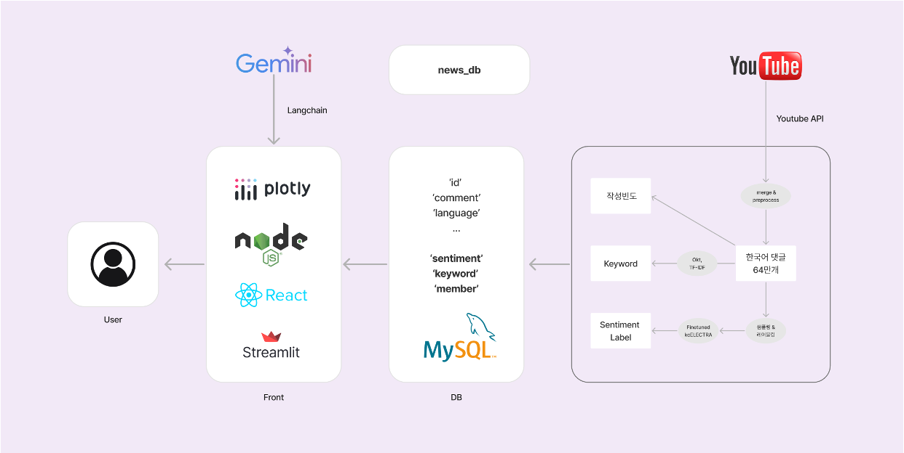
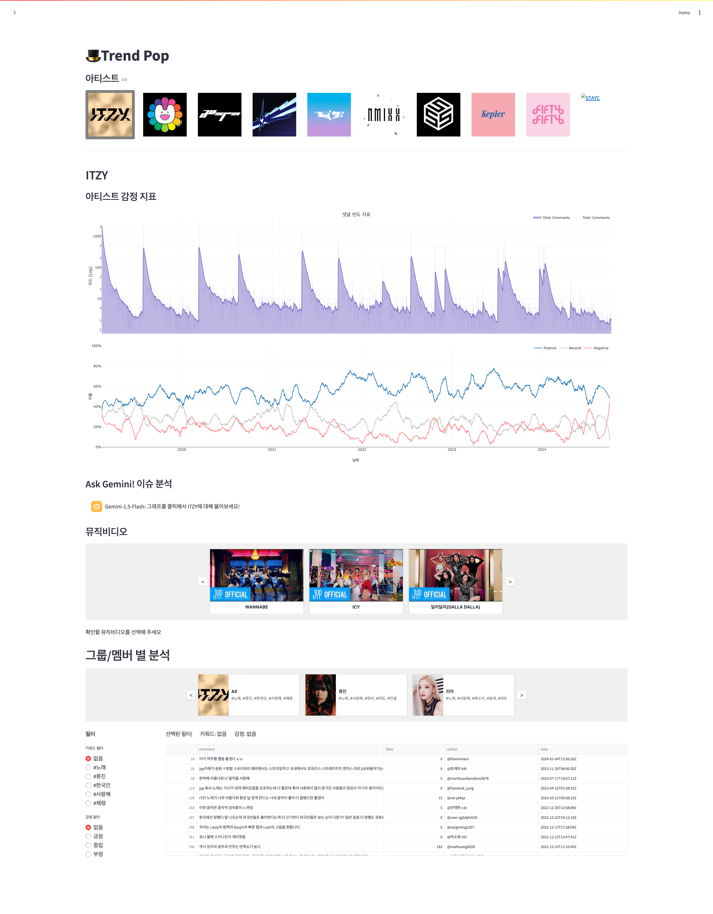

# K-pop YouTube 뮤직비디오 댓글 분석 대시보드 (Google-NIPA ML 실무 부트캠프)

Date: September 23, 2024 → October 22, 2024

# 프로젝트 개요

## 동기

K-pop의 인기가 전 세계적으로 높아지는 상황, 뮤직비디오 댓글을 통해 팬들의 반응을 분석하면 의미 있는 통찰을 얻을 수 있을 것으로 판단하여 자연어 처리 기술을 활용한 대시보드 제작을 결정하였습니다.

## 목표

한 달이라는 짧은 기간 내에 달성 가능한 현실적인 목표로 설정 - 크게 3가지 기능을 갖춘 대시보드

- 감정 분석(Sentiment Analysis)
    - 댓글의 감정을 분석하여, 전체적인 댓글의 긍/부정 비율을 한 눈에 볼 수 있는 그래프로 표현
- Gemini API 질의 프롬프트
    - 위 그래프에서 선택한 기간에 어떤 일이 있었는지 Gemini LLM에게 질의하는 기능
- 키워드 추출 & 감정 분석
    - 해당 아티스트 그룹, 멤버에 연관되는 키워드를 추출하고 어떤 감정(긍정, 중립, 부정)과 연관되어 있는지 표현

## 시스템 설계



# 나의 기여

## 댓글 크롤링

구글에서 공식적으로 제공하는 Youtube_data_api_v3 를 이용해서 유튜브 댓글을 불러오는 크롤러를 작성하였습니다. 불러올 댓글이 너무 많아서 중간에 api 요청이 끊기는 경우를 대비하여 배치 형식으로 끊어서 저장한 뒤, 나중에 합치는 방식으로 코드를 작성하였습니다.

- 수집기 소스코드
    
    ```python
    import csv
    import os
    from googleapiclient.discovery import build
    from googleapiclient.errors import HttpError
    import pandas as pd
    import json
    import re
    import time
    from datetime import datetime, timedelta
    
    # 유튜브 api 셋업
    def setup_youtube_api(api_key):
        youtube = build('youtube', 'v3', developerKey=api_key)
        return youtube
    
    # 비디오 타이틀 받아오기
    def get_video_details(youtube, video_id):
        try:
            response = youtube.videos().list(
                part="snippet",
                id=video_id
            ).execute()
    
            if response['items']:
                title = response['items'][0]['snippet']['title']
                return title
            else:
                return None
        except HttpError as e:
            print(f"비디오 세부 정보를 가져오는 중 오류 발생: {e}")
            return None
    
    # time anchor 말고도 띄어쓰기, 엔터, ',' 제거해서 넣기
    def preprocess_comment(text):
        # Remove time anchors
        text = re.sub(r'<a href="https://www\.youtube\.com/watch\?v=[^&]+&amp;t=\d+">(.*?)</a>', r'\1', text)
        # Replace <br> tags with space
        text = re.sub(r'<br\s*/?>', ' ', text)
        # Replace newlines with space
        text = text.replace('\n', ' ')
        # Replace commas with space
        text = text.replace(',', ' ')
        # Remove extra spaces
        text = ' '.join(text.split())
        return text
    
    # 실제로 비디오 댓글 대댓글 받아오는 함수 (10만건씩 배치로 나누어 저장되도록 설정했으며, max_comments는 전체 댓글로 설정)
    def get_video_comments(youtube, video_id, video_title, max_comments=None, batch_size=100000):
        comments = []
        next_page_token = None
        total_comments = 0
        batch_count = 0
        page_count = 0
        max_retries = 5
        token_retry_count = 0
        max_token_retries = 3
    
        while max_comments is None or total_comments < max_comments:
            try:
                response = youtube.commentThreads().list(
                    part="snippet,replies",
                    videoId=video_id,
                    maxResults=100,
                    pageToken=next_page_token
                ).execute()
    
                page_count += 1
    
                for item in response['items']:
                    if max_comments is not None and total_comments >= max_comments:
                        break
    
                    comment = item['snippet']['topLevelComment']['snippet']
                    comment_data = {
                        'comment_type': 'node',
                        'comment_id_key': item.get('id', ''),
                        'parent_id_key': None,
                        'comment': preprocess_comment(comment.get('textDisplay', '')),
                        'author': comment.get('authorDisplayName', ''),
                        'date': comment.get('publishedAt', ''),
                        'likes': comment.get('likeCount', 0),
                    }
    
                    comments.append(comment_data)
                    total_comments += 1
    
                    if 'replies' in item:
                        for reply in item['replies']['comments']:
                            if max_comments is not None and total_comments >= max_comments:
                                break
    
                            reply_snippet = reply['snippet']
                            reply_data = {
                                'comment_type': 'reply',
                                'comment_id_key': reply_snippet.get('id', ''),
                                'parent_id_key': item.get('id', ''),
                                'comment': preprocess_comment(reply_snippet.get('textDisplay', '')),
                                'author': reply_snippet.get('authorDisplayName', ''),
                                'date': reply_snippet.get('publishedAt', ''),
                                'likes': reply_snippet.get('likeCount', 0),
                            }
                            comments.append(reply_data)
                            total_comments += 1
    
                    if len(comments) >= batch_size:
                        batch_count += 1
                        save_to_csv(comments, video_title, f"{sanitize_filename(video_title)}_batch_{batch_count}.csv")
                        print(f"배치 {batch_count} 저장 완료: 총 {total_comments}개 댓글 처리됨")
                        comments = []
    
                current_token = next_page_token
                next_page_token = response.get('nextPageToken')
    
                if not next_page_token:
                    if token_retry_count < max_token_retries:
                        token_retry_count += 1
                        time.sleep(5 * token_retry_count)
                        next_page_token = current_token
                        continue
                    else:
                        print("댓글 수집 완료")
                        break
    
                token_retry_count = 0
                time.sleep(1)
    
            except HttpError as e:
                if 'quotaExceeded' in str(e):
                    print("API 할당량 초과. 댓글 수집을 종료합니다.")
                    break
    
                retry_count += 1
                if retry_count > max_retries:
                    print(f"최대 재시도 횟수 초과. 오류: {e}")
                    break
                print(f"오류 발생: {e}. {retry_count}번째 재시도 중...")
                time.sleep(5 * retry_count)
    
        if comments:
            batch_count += 1
            save_to_csv(comments, video_title, f"{sanitize_filename(video_title)}_batch_{batch_count}.csv")
            print(f"최종 배치 {batch_count} 저장 완료: 총 {total_comments}개 댓글 처리됨")
    
        print(f"댓글 수집 완료: 총 {total_comments}개의 댓글을 {page_count}개 페이지에서 수집했습니다.")
        return total_comments, batch_count
    
    # comments 파일 csv파일로 저장하는 함수
    def save_to_csv(comments, video_title, filename):
        if not comments:
            print(f"저장할 댓글이 없습니다. '{filename}' CSV 파일이 생성되지 않습니다.")
            return
    
        try:
            df = pd.DataFrame(comments)
    
            # 'likes' 열을 정수로 변환
            df['likes'] = pd.to_numeric(df['likes'], downcast='integer')
    
            # 저장할 열 순서
            columns_order = ['comment_type', 'comment_id_key', 'parent_id_key', 'comment', 'author', 'date', 'likes']
            df = df[columns_order]
    
            file_path = '/content/drive/MyDrive/Colab Notebooks/youtube/' + filename
            df.to_csv(file_path, index=False, encoding='utf-8-sig', quoting=csv.QUOTE_ALL)
            print(f"댓글이 {file_path}에 저장되었습니다.")
        except Exception as e:
            print(f"CSV 파일 저장 중 오류 발생: {e}")
            print("Comments data:")
            print(comments[:5])
    
    # 저장할 때 활용
    def sanitize_filename(filename):
        return re.sub(r'[\\/*?:"<>|]', "", filename)
    
    # 혹시나 최대 요청값 도달시 정지 후 다시 돌리는 함수
    def wait_for_quota_reset():
        now = datetime.now()
        reset_time = datetime(now.year, now.month, now.day, 0, 0, 0) + timedelta(days=1)
        wait_time = (reset_time - now).total_seconds()
    
        print(f"할당량 리셋까지 {wait_time/3600:.2f} 시간 대기 중...")
        time.sleep(wait_time)
        print("할당량이 리셋되었습니다. 데이터 수집을 재개합니다.")
    
    # 메인 함수 실행
    if __name__ == "__main__":
        api_key = userdata.get('youtube_api_key')
        youtube = setup_youtube_api(api_key)
        videos = [
                  'YEA1ROHi0Eg', # 유튜브 영상 id 입력 ex) aespa 에스파 'Live My Life' MV
                  ]
    
        for video_id in videos:
            video_title = get_video_details(youtube, video_id)
            if video_title:
                print(f"비디오 제목: {video_title}의 댓글을 가져오는 중...")
                total_comments, total_batches = get_video_comments(youtube, video_id, video_title, max_comments=None, batch_size=100000) # 맥스 제한 수정
                print(f"총 처리된 댓글 수: {total_comments}")
                print(f"총 배치 수: {total_batches}")
                print("모든 댓글이 성공적으로 처리되었습니다.")
            else:
                print("비디오 세부 정보를 가져오는데 실패했습니다.")
    ```
    
- 배치로 나뉜 댓글파일 병합 소스코드
    
    ```python
    import pandas as pd
    import os
    import glob
    import re
    
    def get_video_title(filename):
        # Extract the video title from the filename
        match = re.match(r'(.+?)_batch_\d+\.csv', filename)
        return match.group(1) if match else filename
    
    def combine_csv_files(input_path, file_pattern="*_batch_*.csv"):
        csv_files = glob.glob(os.path.join(input_path, file_pattern))
    
        if not csv_files:
            print(f"No CSV files found matching the pattern '{file_pattern}' in {input_path}")
            return
    
        # Group files by video title
        video_groups = {}
        for file in csv_files:
            filename = os.path.basename(file)
            video_title = get_video_title(filename)
            if video_title not in video_groups:
                video_groups[video_title] = []
            video_groups[video_title].append(file)
    
        for video_title, files in video_groups.items():
            print(f"\nProcessing video: {video_title}")
            all_dfs = []
    
            for file in files:
                print(f"Reading file: {file}")
                df = pd.read_csv(file, encoding='utf-8-sig')
                all_dfs.append(df)
                print(f"Successfully read {os.path.basename(file)}, shape: {df.shape}")
    
            if all_dfs:
                combined_df = pd.concat(all_dfs, ignore_index=True)
                print(f"Combined shape for {video_title}: {combined_df.shape}")
    
                output_filename = f"{video_title}.csv"
                output_path = os.path.join(input_path, output_filename)
                combined_df.to_csv(output_path, index=False, encoding='utf-8-sig')
                print(f"Combined CSV for {video_title} saved to: {output_path}")
            else:
                print(f"No valid data found for {video_title}")
    
        print("\nAll videos processed.")
    
    # Usage
    #input_path = '/content/drive/~~'
    file_pattern = '*_batch_*.csv'
    
    combine_csv_files(input_path, file_pattern)
    ```
    

## 감정분석 모델 파인튜닝 (KcElectra 모델)

K-pop 유튜브 뮤직비디오 댓글 분석 대시보드를 설계 및 구축하고, 자체 라벨링된 데이터로 KcELECTRA 모델을 파인튜닝하여 감성 분석 라벨링 정확도 향상 

- 결과 비교 기록:
    
    
    | **Model** | **Accuracy** | **Precision** | **Recall** | **F1-Score** |
    | --- | --- | --- | --- | --- |
    | **KcELECTRA 12000 sampled finetuned (선정)** | **0.918011** | **0.851625** | **0.880576** | **0.864481** |
    | 4o | 0.90457 | 0.829732 | 0.866307 | 0.844036 |
    | KcELECTRA 17000 oversampled finetuned | 0.895161 | 0.820019 | 0.852437 | 0.833488 |
    | 4o prompt | 0.905914 | 0.824174 | 0.841612 | 0.832502 |
    | 4o-mini prompt | 0.879032 | 0.781747 | 0.810755 | 0.793331 |
    | koELECTRA(Max) | 0.880376 | 0.800417 | 0.781084 | 0.790099 |
    | 4o-mini | 0.86828 | 0.780447 | 0.794009 | 0.777354 |
    | 4o finetuned 283 examples | 0.889785 | 0.824535 | 0.741701 | 0.768945 |
    | koELECTRA(Sum) | 0.876344 | 0.840351 | 0.723631 | 0.749794 |
    | kote-ELECTRA 200-finetuned | 0.643817 | 0.399864 | 0.413798 | 0.37505 |

## Streamlit으로 대쉬보드 UI 구현

### 효율적인 파일 구조 구성


Streamlit의 메인 페이지가 되는 파이썬 파일은 src/home.py로 구성하고 이 외 다른 페이지는 pages에 생성했으며, 그리고 각 기능을 담당하는 함수들은 src/utils 파일에서 구현하였습니다. 또한, react 컴포넌트를 구성하는 장소는 carousel_component 라는 폴더를 별도로 구성하여 연결 하였습니다.

### MySQL로 데이터베이스를 구축, 페이지 부하 감소

- MySQL 데이터베이스 서버를 열어서 Streamlit 과 연동하였습니다. 불러와야 하는 댓글의 양이 많기 때문에 모든 댓글을 바로 페이지에 로드할 수 없어, 키워드 추출 등 해당하는 쿼리를 데이터베이스에 요청하여 불러오도록 구현하였습니다.
- 전체 데이터 불러오는 소스코드 (쿼리)
    
    ```python
    def fetch_all_data(conn, idol_group):
        queries = {
            'group_comments': f"SELECT * FROM comments WHERE `Group` = '{idol_group}';",
            'mv_thumbnail': f"SELECT * FROM mv_thumbnail WHERE `group` = '{idol_group}';",
            'member_thumbnail': f"SELECT * FROM member_thumbnail WHERE `Group` = '{idol_group}';"
        }
        return {key: cached_query(conn, query) for key, query in queries.items()}
    ```
    

### React의 컴포넌트를 제작하여 UI/UX 개선

- Streamlit에서 React 컴포넌트를 제작하여 연동하였습니다. 그룹 멤버와, 뮤직비디오를 고를 때 모든 선택지를 Streamlit에서 제공하는 버튼으로 제작하면 대시보드가 혼잡해보일 수 밖에 없었습니다. 해당 사항을 해결하기 위해서 React 컴포넌트 Carousel(회전목마) 를 직접 제작하여 3개 정도의 버튼만을 띄워두고 우측, 좌측 화살표를 클릭하여 버튼 내용이 바뀌도록 구성하였습니다.
- 뮤직비디오, 멤버 별 분석 선택지 UI 사진:



# 기능 구현

## 목표 UI (Figma)


## 완성 UI (Streamlit 웹 페이지)


